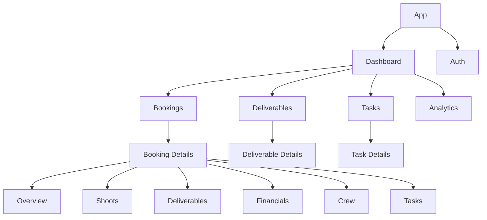

# Project Reference Documentation

## Project Overview

- Next.js project using App Router
- TypeScript-based
- Uses shadcn/ui components (New York style)
- Turbopack enabled for development

## Tech Stack

- Next.js 15.2.2
- React 19
- TypeScript
- Tailwind CSS
- Radix UI Components
- Lucide Icons

## Project Structure

## rakesh kumar

Copy

Delete

Workspace go through all the code and make yourself familiar with code base..create a reference file yourself..what ever you learn about the codebase and keep updating whenever you learn something or made some changes..make sure to add it in gitignore

## Trae AI

23 context(s) used

Workspace

.gitignore 2-44

README.md 25-34

README.md 5-25

utils.ts 2-9

env.ts 2-25

... More ( 17 +)

I'll help you create a reference file that documents the codebase structure and important details. Let's create this file while ensuring it's ignored by git.

First, let's add the reference file to .gitignore :

```plaintext
# ... existing ignores ...

# Project reference documentation
.project-reference.md

```

Now, let's create the reference file:

````markdown
# Project Reference Documentation

## Project Overview

- Next.js project using App Router
- TypeScript-based
- Uses shadcn/ui components (New York style)
- Turbopack enabled for development

## Tech Stack

- Next.js 15.2.2
- React 19
- TypeScript
- Tailwind CSS
- Radix UI Components
- Lucide Icons

## Project Structure

```markdown
src/
├── app/ # Next.js App Router
├── components/ │ ├── ui/ # Shadcn UI components
│ └── app-sidebar # Custom components
├── lib/ # Utility functions
└── hooks/ # Custom React hooks

## Key Components

1. **Layout System**

   - Uses Geist and Geist Mono fonts
   - Base layout with antialiased text

2. **UI Components**

   - Sidebar system with collapsible functionality
   - Breadcrumb navigation
   - Tooltip system
   - Input components
   - Dropdown menus

3. **Environment Configuration**

   - T3 Env setup for type-safe environment variables
   - Required variables:
     - DATABASE_URL
     - OPEN_AI_API_KEY
     - NEXT_PUBLIC_PUBLISHABLE_KEY

4. **Development Tools**
   - ESLint configuration
   - TypeScript strict mode enabled
   - Path aliases configured (@/ for src/)

## Styling

- Tailwind CSS with custom configuration
- CSS Variables for theming
- Animation utilities via tailwindcss-animate

## Notes

- Development server runs with Turbopack
- Build errors for TypeScript and ESLint are ignored in production
- Uses Next.js App Router pattern
- Implements responsive design patterns

## Project Tasks & Progress

### API Endpoints
- [ ] Implement PATCH/PUT endpoints
- [ ] Implement DELETE endpoints
- [ ] Add error handling middleware
- [ ] Add request body validation

### Data Access Layer
- [ ] Implement update operations in queries.ts
- [ ] Implement delete operations in queries.ts
- [ ] Add transaction handling
- [ ] Add data validation

### Authentication & Authorization
- [ ] Implement role-based access control (RBAC)
- [ ] Add route protection middleware
- [ ] Implement user permissions system

### Features & Components
- [ ] Add edit functionality for resources
- [ ] Implement delete operations in UI
- [ ] Add loading states
- [ ] Implement error boundaries
- [ ] Add form validation
- [ ] Implement search functionality
- [ ] Add filtering options in tables
- [ ] Implement pagination controls

### Dashboard
- [ ] Implement analytics/statistics
- [ ] Add overview charts/graphs
- [ ] Implement recent activity feed
- [ ] Add calendar view for shoots/events

### File Management
- [ ] Implement file upload system
- [ ] Add file storage integration
- [ ] Implement image optimization

### Testing
- [ ] Add unit tests
- [ ] Implement integration tests
- [ ] Add E2E tests
- [ ] Implement test coverage reporting

### Performance
- [ ] Implement data caching
- [ ] Add optimistic updates
- [ ] Implement loading skeletons
- [ ] Add error handling UI

### Documentation
- [ ] Add API documentation
- [ ] Add component documentation
- [ ] Add setup instructions
- [ ] Create deployment guide

### DevOps
- [ ] Set up CI/CD pipeline
- [ ] Add environment configuration
- [ ] Set up monitoring
- [ ] Implement logging system

## Recent Changes
(This section will be updated as tasks are completed)

## Project Architecture


````

erDiagram
    Booking ||--o{ Shoot : has
    Booking ||--o{ Deliverable : contains
    Booking ||--o{ ReceivedAmount : receives
    Booking ||--o{ PaymentSchedule : schedules
    Booking ||--o{ Expense : tracks
    Booking ||--o{ Crew : assigns
    Booking ||--o{ Task : manages
    Booking ||--|| Client : belongs_to
    
    Client {
        string name
        string brideName
        string groomName
        string email
        string phoneNumber
    }
    
    Booking {
        string name
        string bookingType
        string packageType
        decimal packageCost
        datetime createdAt
    }

## API Endpoints
├── bookings/
│   ├── GET / - List bookings
│   ├── GET /[id] - Get booking details
│   └── POST / - Create booking
├── deliverables/
│   ├── GET / - List deliverables
│   └── GET /[id] - Get deliverable
├── tasks/
│   └── GET / - List tasks
└── clients/
    └── GET / - List clients